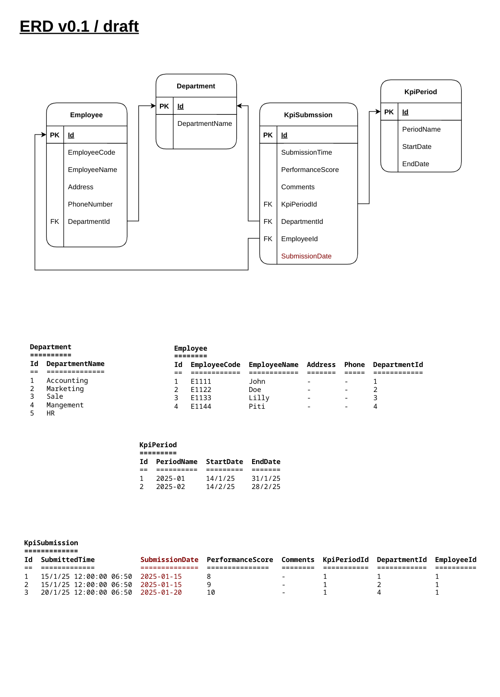
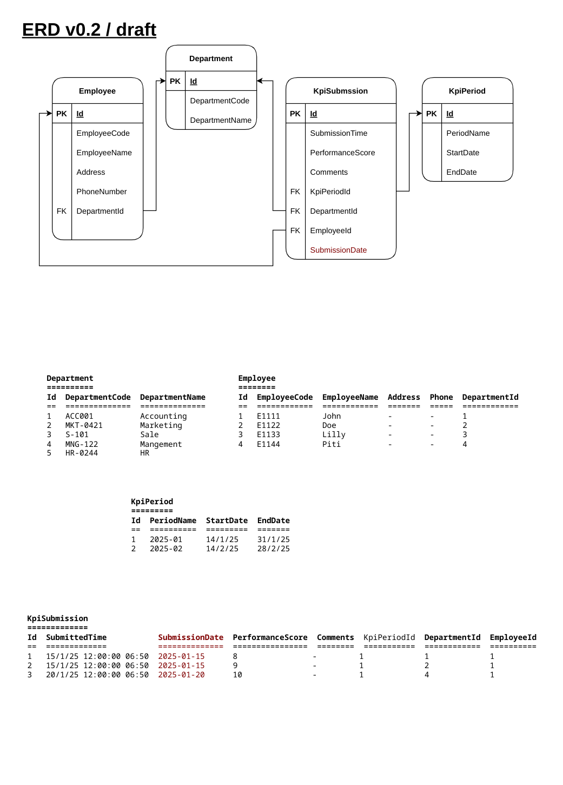
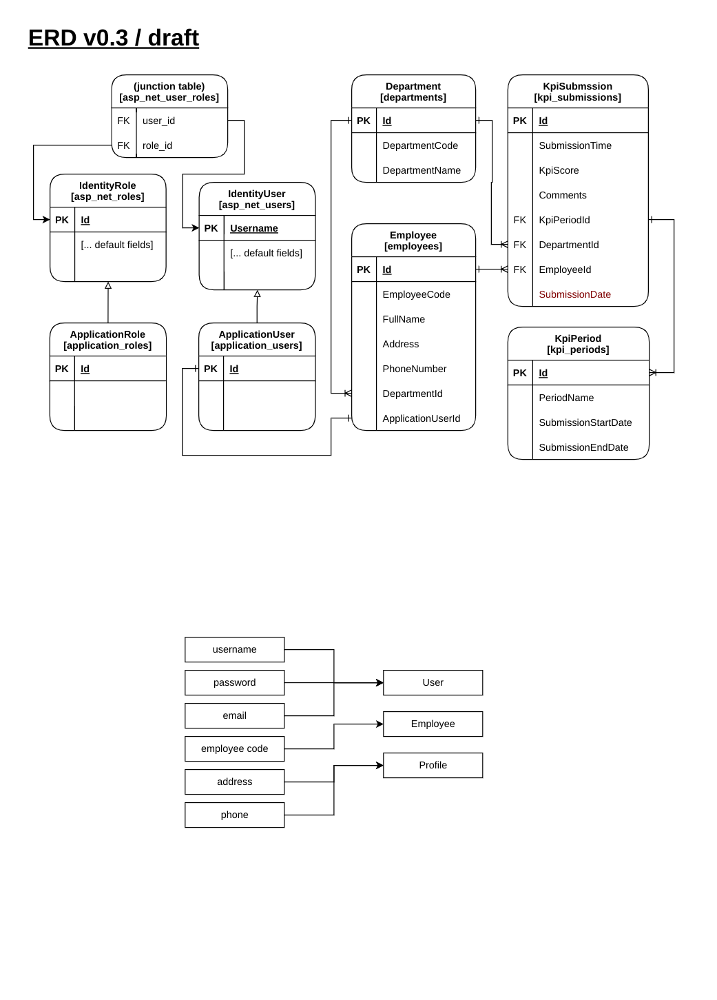
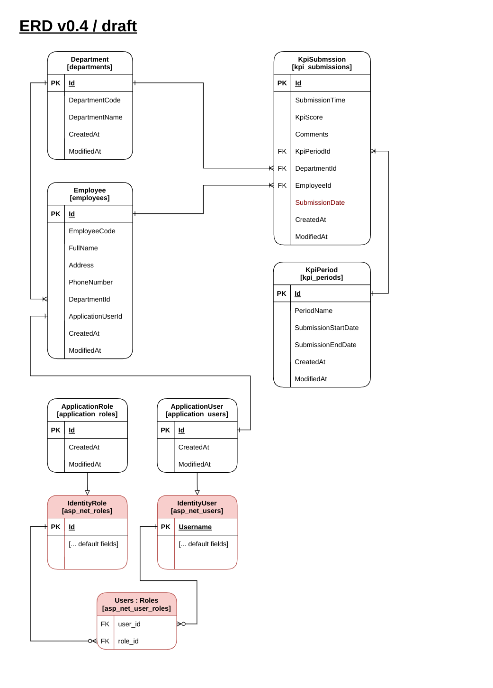
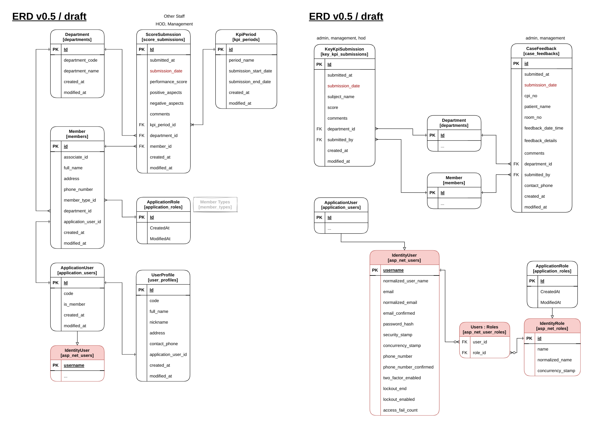
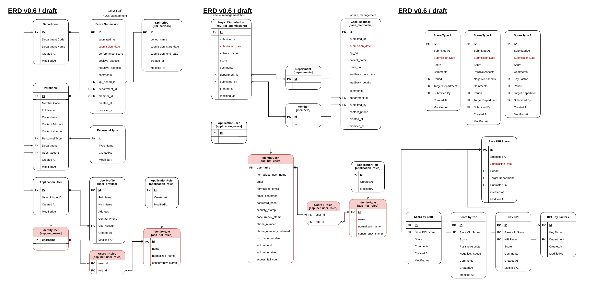
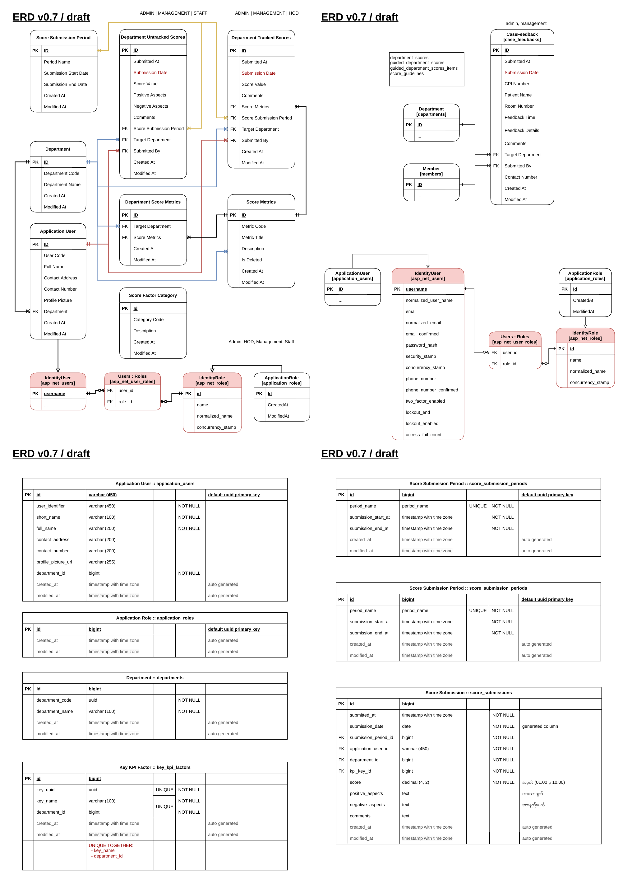
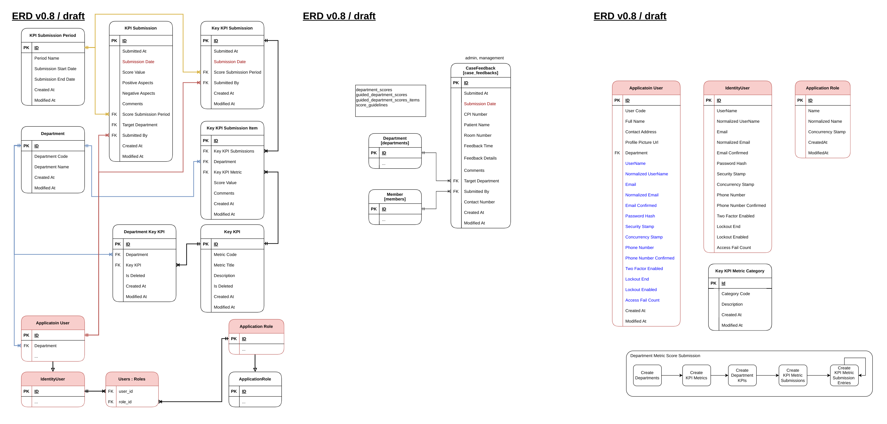

# Project Documentation

Internal application for KPI score submission, calculating, reporting.

## Definition

### User Group

User group to identify user types:

- Staff
- HOD
- Management

### User Role

Currently, there are only 2 user roles:

- Admin
- Staff

### Department

a department

### Score Submission Period

For representing the period for the score submission start date and end date with period name. Period name have the following format `{yyyy-mm}`: `2025-01`.

---

#### User Account

An account must be created to interact with the system

#### Employee/Staff

Each employee owns an employee/staff account

#### Roles

User account have roles to control who can interact with certain part of the system.
Common roles are:

1. Staff
2. HOD
3. Management

---

#### KPI Score

A KPI score, or Key Performance Indicator score, is a measurable value that demonstrates how effectively an organization is achieving key business objectives.

#### KPI Score Submission

KPI Score are submitted by the following category:

1. Submissions by Staff
2. Submissions by HOD
3. Submissions by Management

#### Case Feedback & HR Record

#### Key KPI Score

---

### Database Migrations

```bash
  # Create new migration
  dotnet ef migrations add "InitDb"
  # Remove previous migration
  dotnet ef migrations remove
  # Run migration
  dotnet ef database update
  # Move migration to [MigrationName]
  dotnet ef database update [MigrationName]
  # Undo migration to initial
  dotnet ef database update 0
```

### Packages Used

- Entity Framework Core  
  [Microsoft.EntityFrameworkCore](https://www.nuget.org/packages/Microsoft.EntityFrameworkCore)

- EFCore Tools (CLI)  
  [Microsoft.EntityFrameworkCore.Tools](https://www.nuget.org/packages/Microsoft.EntityFrameworkCore.Tools)

- EFCore Tools (Design)  
  [Microsoft.EntityFrameworkCore.Design](https://www.nuget.org/packages/Microsoft.EntityFrameworkCore.Design)

- .NET Identiy Entity Framework Core  
  [Microsoft.AspNetCore.Identity.EntityFrameworkCore](https://www.nuget.org/packages/Microsoft.AspNetCore.Identity.EntityFrameworkCore)

- PostgreSQL Database Provider  
  [Npgsql.EntityFrameworkCore.PostgreSQL](https://www.nuget.org/packages/Npgsql.EntityFrameworkCore.PostgreSQL)

- EF Core Naming Conventions  
  [EFCore.NamingConventions](https://www.nuget.org/packages/EFCore.NamingConventions)

## URL Routes

| Pages    | Description |
| -------- | ----------- |
| `/`      | home page   |
| `/about` | about page  |

| Admin Dashboard | Description     |
| --------------- | --------------- |
| `/dashboard`    | admin dashboard |

| Account                           | Description            |
| --------------------------------- | ---------------------- |
| `/account/me`                     | view profile           |
| `/account/edit`                   | edit profile (self)    |
| `/account/login`                  | login                  |
| `/account/logout`                 | logout                 |
| `/account/manage/password/change` | request password reset |
| `/account/manage/password/reset`  | Not Implemented!       |

---

| Manage User Accounts               | Description               |
| ---------------------------------- | ------------------------- |
| `/manage/users`                    | user list                 |
| `/manage/users/{userCode}`         | user details              |
| `/manage/users/{userCode}/edit`    | edit user                 |
| `/manage/users/register`           | register new user         |
| `/manage/users/register/success`   | register new user success |
| `/manage/users/groups`             | user list                 |
| `/manage/users/groups/create`      | user list                 |
| `/manage/users/groups/{code}/edit` | user list                 |
| `/manage/users/roles`              | role list                 |
| `/manage/users/roles/create`       | create new role           |

| Manage Departments                          | Description           |
| ------------------------------------------- | --------------------- |
| `/manage/departments`                       | department list       |
| `/manage/departments/create`                | create new department |
| `/manage/departments/{departmentCode}/edit` | edit department       |

| Manage submission periods                       | Description           |
| ----------------------------------------------- | --------------------- |
| `/manage/submissions/periods`                   | kpi period list       |
| `/manage/submissions/periods/create`            | create new kpi period |
| `/manage/submissions/periods/{periodName}/edit` | edit kpi period       |

---

| Manage Key Metrics (KEYS)                                     | Description                             |
| ------------------------------------------------------------- | --------------------------------------- |
| `/manage/submissions/key-metrics`                             | list Key Metrics                        |
| `/manage/submissions/key-metrics/create`                      | create Key Metrics                      |
| `/manage/submissions/key-metrics/edit`                        | edit Key Metrics                        |
| ~~`/manage/submissions/key-metrics/view`~~                    | ~~view Key Metrics~~                    |
| `/manage/submissions/department-key-metrics`                  | list periods for Department Key Metric  |
| `/manage/submissions/department-key-metrics/{2025-01}`        | list Department Key Metrics by {Period} |
| `/manage/submissions/department-key-metrics/{2025-01}/create` | create Key Metrics for {Department}     |
| `/manage/submissions/department-key-metrics/{2025-01}/edit`   | edit Key Metrics for {Department}       |

## Submission Routes

| Department Score Submission (for staff, hod, management) | Description            |
| -------------------------------------------------------- | ---------------------- |
| `/submissions`                                           | submissions index page |
| `/submissions/departments/scores`                        | list submissions       |
| `/submissions/departments/scores/submit/{period-name}`   | submit for kpi scores  |
| `/submissions/departments/scores/success`                | submission success     |

| KEY Metric Submission (KEY KPI)                            | Description               |
| ---------------------------------------------------------- | ------------------------- |
| `/submissions/departments/key-metric`                      | list submissions          |
| `/submissions/departments/key-metric/submit/{period-name}` | submit for key kpi scores |
| `/submissions/departments/key-metric/success`              | submission success        |

---

## Reports

| Reports - Overview... | Description |
| --------------------- | ----------- |
| `/reports/`           | all reports |

| Reports - Department Score Submissions (KPI)                                 | Description                                                      |
| ---------------------------------------------------------------------------- | ---------------------------------------------------------------- |
| ~~`/reports/submissions/departments/`~~                                      | summary or (index of department score submissions)               |
| `/reports/submissions/departments/kpi`                                       | list (department kpi scores submissions)                         |
| `/reports/submissions/departments/kpi/view/{period-name}`                    | list (department kpi scores submissions) by period               |
| `/reports/submissions/departments/kpi/view/{period-name}/?group={groupName}` | list (department kpi scores submissions) by period by user group |

| Reports - Department Score Submissions (KEY KPI)                                | Description                                 |
| ------------------------------------------------------------------------------- | ------------------------------------------- |
| `/reports/submissions/departments/keykpi`                                       | list key kpi                                |
| `/reports/submissions/departments/keykpi/view/{period-name}`                    | list key kpi by period                      |
| `/reports/submissions/departments/keykpi/view/{period-name}/?group={groupName}` | list key kpi by period filter by user group |

### Razor Pages

#### AUTHENTICATED (ADMIN ROLE)

| Url                             | Description                          |
| ------------------------------- | ------------------------------------ |
| /departments                    | manage departments                   |
| /kpi                            | manage kpis                          |
| /kpi/periods                    | manage kpi periods                   |
| /kpi/submissions                | manage kpi submissions               |
| /kpi/submissions?period=2025-01 | manage kpi submissions by kpi period |
|                                 |                                      |

#### AUTHENTICATED (EMPLOYEE ROLE)

| Url                      | Description       |
| ------------------------ | ----------------- |
| /account/profile         | manage self       |
| /services/kpi/submission | Submit a kpi form |
|                          |                   |

#### PUBLIC (NON AUTHENTICATED)

| Url      | Description  |
| -------- | ------------ |
| /about   | info page    |
| /contact | contact page |
|          |              |

## Infrastructure


## Clearn Architecture

Reference from the Microsoft's Common web application architectures article, section [Clean Architecture](https://learn.microsoft.com/en-us/dotnet/architecture/modern-web-apps-azure/common-web-application-architectures#clean-architecture)


### Project Structure

- Metrics.Application (application core)
  - Domains/Entities
  - Interfaces
  - DTOs
  - Exceptions
- Metrics.Infrastructure
  - DbContext
  - FluentAPI Entity Configurations
  - Data Seedings
  - Repositories
  - Services
- Metrics.Shared
  - Filters
  - Utils
- Metrics.Web
  - Main ASP.NET app

## ERD/Database Diagrams

### Version 0.1 (Draft)



### Version 0.2 (Draft)



### Version 0.3 (Draft)



### Version 0.4 (Draft)



### Version 0.5 (Draft)



### Version 0.6 (Draft)



### Version 0.7 (Draft)



### Version 0.8 (Draft)



## Client UIs

- Web browser
- Mobile applicaiton

### UI Mockup


