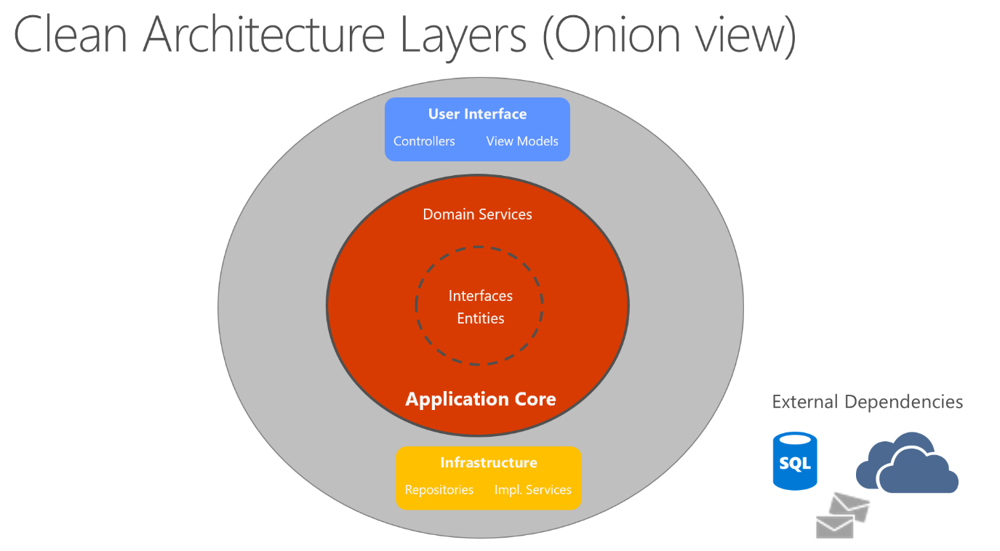
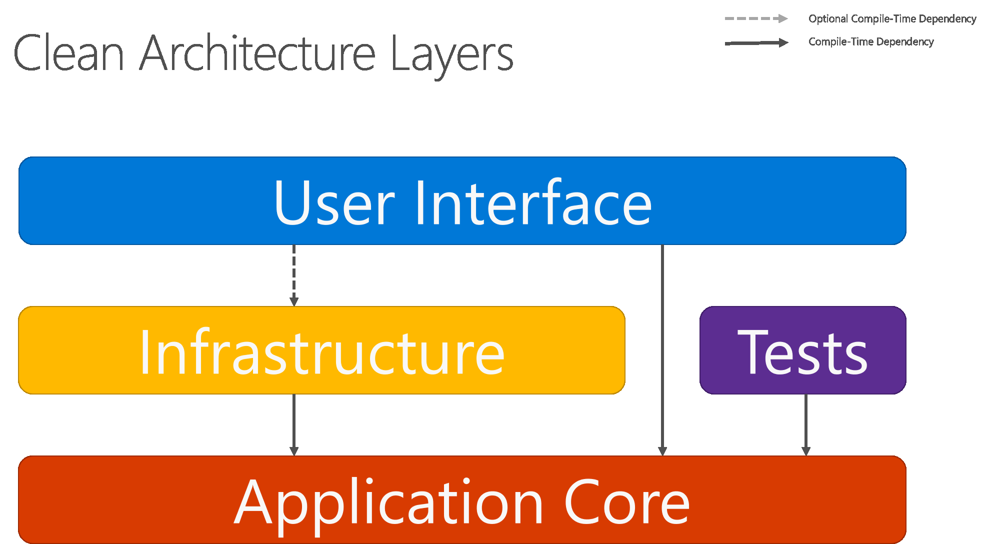

# Documentation

Project Documentation

## Instructions

### Database Migrations

```bash
  # Create new migration
  dotnet ef migrations add "InitDb"
  # Remove previous migration
  dotnet ef migrations remove
  # Run migration
  dotnet ef database update
  # Move migration to [MigrationName]
  dotnet ef database update [MigrationName]
  # Undo migration to initial
  dotnet ef database update 0
```

### Packages Used

| Name                         | Package                                                                                                                               |
| ---------------------------- | ------------------------------------------------------------------------------------------------------------------------------------- |
| Entity Framework Core        | [Microsoft.EntityFrameworkCore](https://www.nuget.org/packages/Microsoft.EntityFrameworkCore)                                         |
| EFCore Tools (CLI)           | [Microsoft.EntityFrameworkCore.Tools](https://www.nuget.org/packages/Microsoft.EntityFrameworkCore.Tools)                             |
| EFCore Tools (Design)        | [Microsoft.EntityFrameworkCore.Design](https://www.nuget.org/packages/Microsoft.EntityFrameworkCore.Design)                           |
| Identiy                      | [Microsoft.AspNetCore.Identity.EntityFrameworkCore](https://www.nuget.org/packages/Microsoft.AspNetCore.Identity.EntityFrameworkCore) |
| MSSQL Database Provider      | [Microsoft.EntityFrameworkCore.SqlServer](https://www.nuget.org/packages/Microsoft.EntityFrameworkCore.SqlServer)                     |
| PostgreSQL Database Provider | [Npgsql.EntityFrameworkCore.PostgreSQL](https://www.nuget.org/packages/Npgsql.EntityFrameworkCore.PostgreSQL)                         |
| EF Core Naming Conventions   | [EFCore.NamingConventions](https://www.nuget.org/packages/EFCore.NamingConventions)                                                   |

## URL Routes

### Razor Pages

#### AUTHENTICATED (ADMIN ROLE)

| Url                             | Description                          |
| ------------------------------- | ------------------------------------ |
| /departments                    | manage departments                   |
| /kpi                            | manage kpis                          |
| /kpi/periods                    | manage kpi periods                   |
| /kpi/submissions                | manage kpi submissions               |
| /kpi/submissions?period=2025-01 | manage kpi submissions by kpi period |
|                                 |                                      |

#### AUTHENTICATED (EMPLOYEE ROLE)

| Url                      | Description       |
| ------------------------ | ----------------- |
| /account/profile         | manage self       |
| /services/kpi/submission | Submit a kpi form |
|                          |                   |

#### PUBLIC (NON AUTHENTICATED)

| Url      | Description  |
| -------- | ------------ |
| /about   | info page    |
| /contact | contact page |
|          |              |

## Infrastructure


### Clearn Architecture

Reference from the Microsoft's Common web application architectures article, section [Clean Architecture](https://learn.microsoft.com/en-us/dotnet/architecture/modern-web-apps-azure/common-web-application-architectures#clean-architecture)




### Project Structure

- Metrics.Application (application core)
  - Domains/Entities
  - Interfaces
  - DTOs
  - Exceptions
- Metrics.Infrastructure
  - DbContext
  - FluentAPI Entity Configurations
  - Data Seedings
  - Repositories
  - Services
- Metrics.Shared
  - Filters
  - Utils
- Metrics.Web
  - Main ASP.NET app

## ERD Diagrams


## Client UIs

- Web browser
- Mobile applicaiton

### UI Mockup


