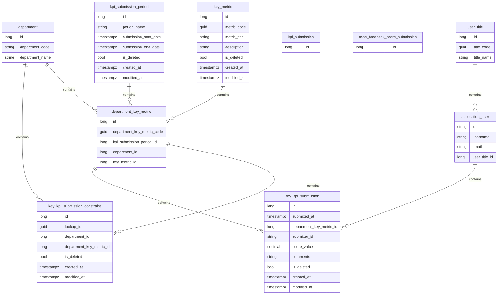

# Development Documentation

## Features

1. Basic
   - User Mangement
     - User Roles and Groups
     - Lock/Unlock
     - Authorization
   - Submission Period
   - Departments
2. Department Key KPI
   - Key Metrics
   - Department Keys
   - Key KPI Submission Rules
3. Department Case Feedback Submission
4. Department KPI Score Submission (base kpi)
5. Department Key KPI Score Submission (key kpi)
6. Department Case Feedback Score Submission (case feedback)
7. Reports

## Database

## Initial Setup

ပထမဦးဆုံး စနစ်ကိုစတင်အသုံးပြုလျှင် sysadmin အကောင့်တစ်ခုထားရှိရမည်ဖြစ်သည်။ ၎င်းအကောင့်မှတဆင့် စနစ်အသုံးပြုသူ အကောင့်များကို ဆက်လက်တည်ဆောက်ရမည်။

## User Management

အသုံးပြုသူ/user များကို အသစ်ထည့်သွင်းခြင်း၊ ဖျက်သိမ်းခြင်း၊ ခေတ္တရပ်တန့်ခြင်းများ လုပ်ဆောင်နိုင်သည်။

### User Roles and Groups

#### User Role

User roles ၂ မျိုးရှိသည့်အနက် Admin role သည်စနစ်အသုံးပြုသူနှင့် မသက်ဆိုင်ပါ။ စနစ်အသုံးပြုသူသည် Staff role ဖြစ်ရမည်။ ဥပမာ sysadmin အကောင့်သည် Admin role ဖြစ်သည်။

- Admin
- Staff

#### User Group or User Title

User group ဖြင့်အသုံးပြုသူ အမျိုးအစားခွဲခြားခြင်းထားနိုင်သည်။

စနစ်အသုံးပြုသူတိုင်းသည် Staff role များဖြစ်ကြသော် user group ဖြင့်ထပ်ဆင့်အမျိုးအစားခွဲခြားနိုင်သည်။

User group ကိုအသုံးပြုပြိး authorization များကန့်သတ်ထားသည်။

User Groups:

- Staff
- HOD
- Management

---

### Authorization

| User with Role | manage users | give feedback | submit feedback score | submit department kpi score | submit key kpi score |
| -------------- | ------------ | ------------- | --------------------- | --------------------------- | -------------------- |
| ADMIN          | YES          | NO            | NO                    | NO                          | NO                   |
| STAFF          | NO           | YES           | NO                    | YES                         | NO                   |
| HOD            | NO           | NO            | NO                    | YES                         | YES                  |
| MANAGEMENT     | NO           | NO            | YES                   | YES                         | YES                  |

#### Policies

1. A Policy can have one or more requirements
   - A Policy is fufilled, if all of requirements are satisfied.
2. A Requirement can have one or more handlers
   - A Requirement is fufilled, if any of handlers are statisfied.

- CanAccessAdminFeaturesPolicy
- CanGiveFeedbackPolicy
- CanSubmitKpiScorePolicy
- CanSubmitKeyKpiScorePolicy
- CanSubmitFeedbackScorePolicy
- CanGiveFeedbackPolicy

#### Requirements

- AccessAdminFeaturesRequirement
- GiveFeedbackRequirement
- SubmitKpiScoreRequirement
- SubmitKeyKpiScoreRequirement
- SubmitFeedbackScoreRequirement

#### Requirement Handlers

- AccessAdminFeaturesHandler
- GiveFeedbackHandler
- SubmitKpiScoreHandler
- SubmitKeyKpiScoreHandler
- SubmitFeedbackScoreHandler

## Submission Period

- Period name
- Start Date
- End Date

## Departments

- Department name

---

## Department Key KPI

### Key Metrics

### Department Keys

## Key KPI Submission Rules

## Department Case Feedback Submission

## Department KPI Score Submission (base kpi)

## Department Key KPI Score Submission (key kpi)

### Flowchart

## Department Case Feedback Score Submission (case feedback)

### Department

a department
